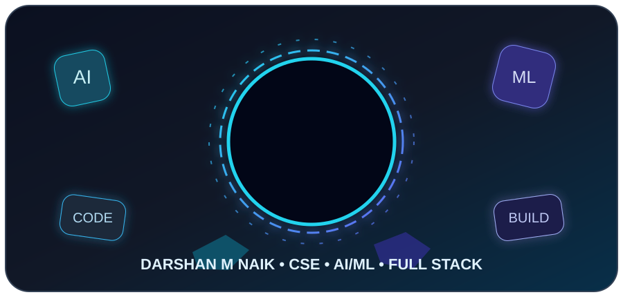
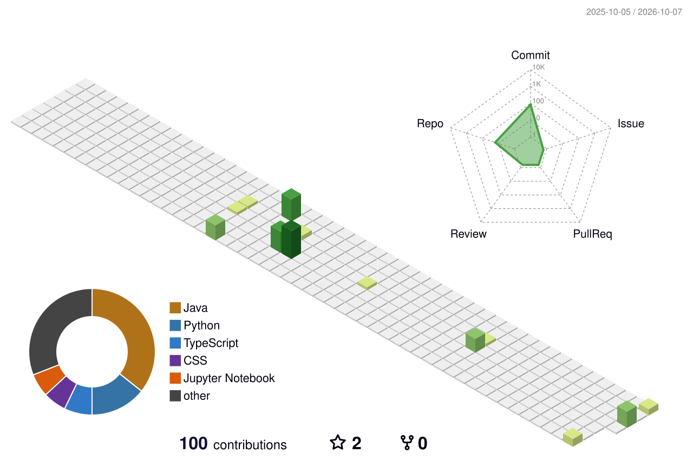

<!-- FULLY 3D GITHUB PROFILE -->

<div align="center">




<br/>


</div>

---

# 🧊 3D DEVELOPER PROFILE

<div align="center">

**Darshan M Naik** • Computer Science & Engineering • AI/ML • Full Stack

</div>

### ⚡ What I Build

- 🤖 AI and machine-learning applications
- 👁️ Computer-vision systems
- 🌐 Full-stack web applications
- 📱 Android applications
- 🧠 Data-driven and automation solutions
- 🏆 Hackathon prototypes and real-world problem-solving projects

---

# 🌀 3D CONTRIBUTION WORLD

<div align="center">



</div>

---

# 🧊 TECH STACK

<div align="center">


</div>

---

# 🚀 3D PROJECT SHOWCASE

<table>
<tr>
<td width="50%" valign="top">

### 🤖 AI Training Centre Monitoring

AI-powered monitoring for attendance and infrastructure compliance.

**Stack:** Python • YOLO • OpenCV • FastAPI • React • TypeScript • PostgreSQL

</td>
<td width="50%" valign="top">

### 💰 SmartSpend AI

AI-assisted Android expense management with bill scanning, categorization and insights.

**Stack:** Android • Firebase • AI/ML

</td>
</tr>
<tr>
<td width="50%" valign="top">

### 🍔 Online Food Ordering

Full-stack Java food ordering system using MVC + DAO and raw JDBC.

**Stack:** Java 17 • Jakarta EE • JSP • Servlets • JDBC • MySQL • Tomcat

</td>
<td width="50%" valign="top">

### 📧 Email Detection System

Python-based email analysis and detection project.

**Stack:** Python • Machine Learning

</td>
</tr>
</table>

---

# 📊 3D-STYLE GITHUB ANALYTICS

<div align="center">


</div>

<div align="center">


</div>

---

# 🐍 ANIMATED CONTRIBUTION SNAKE

<div align="center">

<picture>
  <source media="(prefers-color-scheme: dark)" srcset="./dist/github-snake-dark.svg">
  <source media="(prefers-color-scheme: light)" srcset="./dist/github-snake.svg">
  
</picture>

</div>

---

# 🏆 ACHIEVEMENTS

<div align="center">


</div>

---

# 🎯 CURRENT FOCUS

<div align="center">

```
AI / ML              ████████████████████░
Computer Vision      ███████████████████░░
Full Stack           ███████████████████░░
Data Science         ████████████████░░░░░
Problem Solving      ████████████████████░
Hackathons           ███████████████████░░
```

</div>

---

# 📈 ACTIVITY

<div align="center">


</div>

---

# 🌐 CONNECT

<div align="center">

<a href="https://github.com/damr-web"></a>
<a href="https://www.linkedin.com/"></a>

</div>

<div align="center">


</div>
